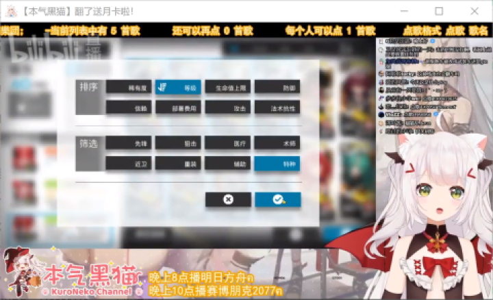
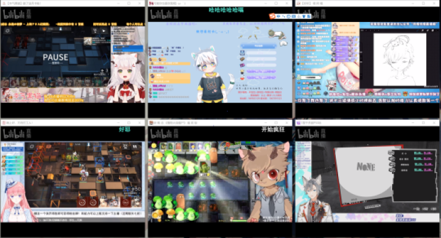
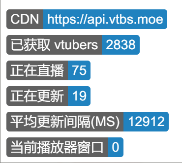
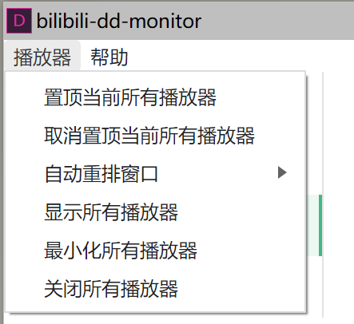

<h1 align="center">
  
</h1>

<h4 align="center">专为DD设计的多屏直播观看工具</h4>

  
  
  
  
  
  
  
  
  

|  Living            |  Follow | vtuber-list            |  setting |
|---------------------|----------------------|---------------------|----------------------|
|  |   | |   |

|   player     |  multi-player |real-time-indicator  |  player-menu |
|---------------------|----------------------|---------------------|----------------------|
|  |   | |   |

## Table of Contents
<!-- START doctoc generated TOC please keep comment here to allow auto update -->
<!-- DON'T EDIT THIS SECTION, INSTEAD RE-RUN doctoc TO UPDATE -->

- [License](#license)

<!-- END doctoc generated TOC please keep comment here to allow auto update -->

## Introduction
Bilibili-dd-monitor是一个专为bilibili dd 设计的多屏观看vtuber直播的实用工具。

## Motivation
> why this project exists?

有时，你关注的多个vtuber会同时在线直播。此时，你有以下方法：
- 使用手机：受限于手机屏幕尺寸，几乎不可能多开观看；
- 使用纯浏览器：受限于纯浏览器的标签窗口，切换麻烦。或者尝试将浏览器窗口缩小，手动编排窗口，这种方式比较原生，是可行的。但是具有非常明显的两个缺点：
  - 1.手动编排多个窗口需要耗费人力，长久而言可能会产生疲惫感。
  - 2.原生浏览器窗口页面元素（除播放器外）过多，不容易控制尺寸，而且比较占系统资源。这也是为什么多开直播窗口会卡的缘故。当然，该软件不能解决多开播放器卡顿的问题，最多是理论上的缓解。

于是，第一个核心功能出现：多开播放器，支持同时观看直播视频。

第二个核心功能是：需要一个能实时获取/检测vtuber是否开播/下播的机制，这样就能在做别的事情时得到通知。很欣慰的是，这样的一个数据API接口已经有DD做了。
> 来自于DD-Center的vtbs.moe数据中心。

## License

