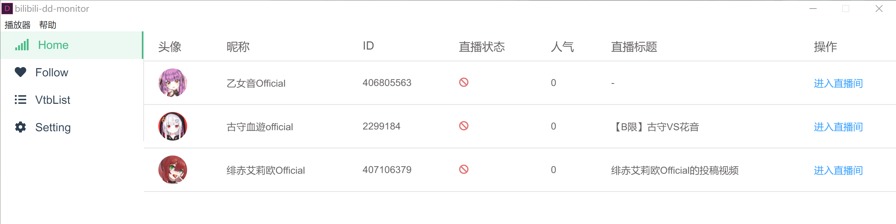

<h1 align="center">
   
  
   
</h1>

<h4 align="center">专为DD设计的多屏直播观看工具</h4>

|  Living            |  Follow |
|---------------------|----------------------|
|  |   |

|  vtuber-list            |  setting |
|---------------------|----------------------|
|  |   |

## License

