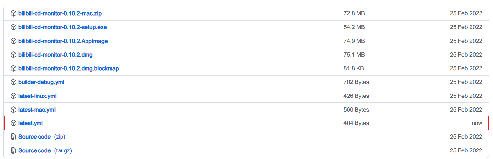
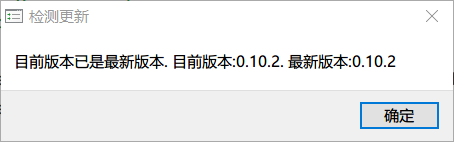

# electron app release on github

## github action release

> https://github.com/actions/create-release

## electron-updater mechanism

If test locally, make sure has this yml file under your build folder(`/dist_electron`).

```yml
# copy this file to build folder(/dist_electron) when test autoUpdate locally
owner: wdpm
repo: bilibili-dd-monitor
provider: github
```

After you call `autoUpdater.checkForUpdates()` function, maybe you will get this error:

```
autoUpdater.checkForUpdates() reject: Error: Cannot find latest.yml in the latest release artifacts 
(https://github.com/wdpm/bilibili-dd-monitor/releases/download/v0.10.2/latest.yml):
```

We can learn from this: electron-updater uses latest-*.yml file to get update metadata.

**So, we must put these yml files on GitHub releases when packaging releases.**

Here is a previous valid `latest.yml` for Windows platform:

```yml
version: 0.9.4
files:
  - url: bilibili-dd-monitor-0.9.4-setup.exe
    sha512: N9UxsQNTzv/U95nYsqyFWQ9bWjtLKx2KvuhBRrGpV9JH6bgdBx+WxLN6n8+mjpRCrFw8sITloN7fc80DN6V4HQ==
    size: 56912108
path: bilibili-dd-monitor-0.9.4-setup.exe
sha512: N9UxsQNTzv/U95nYsqyFWQ9bWjtLKx2KvuhBRrGpV9JH6bgdBx+WxLN6n8+mjpRCrFw8sITloN7fc80DN6V4HQ==
releaseName: 0.9.4 version update
releaseDate: '2021-10-25T12:46:12.941Z'
```

The most important fields are:

- `version: 0.9.4` => get certain release version.
- `files.url: bilibili-dd-monitor-0.9.4-setup.exe` => get certain release file for download.

### the usage of blockmap

For example: `bilibili-dd-monitor-0.9.4-setup.exe.blockmap`

> The package block map file is an XML document that contains a list of the app’s files along with indexes
> and cryptographic hashes for each block of data that is stored in the package.

If you use automatic updates, The blockmap file is used for partial / differential updates to your application, to
shrink the update payload size.

### verification test

Manually put `latest.yml` to GitHub for 0.10.2 tag.


Then call check update once again.



## GitHub action package

Now, we need to make sure we have packaged yml files on github release. The key point is our github action workflow
build file.

On Windows OS:

```shell
npx rimraf "dist_electron/!(*.exe)"
```

works well. But the below command can't work.

```shell
npx rimraf "dist_electron/!(*.exe|*.exe.blockmap|*.yml)"
```

The reason is Windows OS can't parse `|` operator correctly.

So, we need other workaround to make this code logic work.
