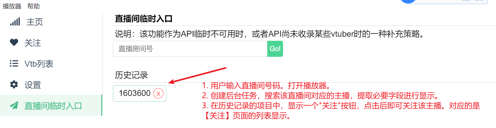

# 直接搜索直播间id来关注主播

> refer: https://github.com/dd-center/bilibili-dd-monitor/issues/5

## impl

1. visit `https://api.live.bilibili.com/xlive/web-room/v1/index/getInfoByRoom?room_id=1603600`
2. API 搜索

> 正常的结果

```json
{
  "code": 0,
  "message": "0",
  "ttl": 1,
  "data": {
    "room_info": {
      "uid": 51030552,
      <=======
      "room_id": 1603600,
      <=======
      "short_id": 0,
      "title": "原神代抽·理性氪金·切勿冲动消费",
      "cover": "http://i0.hdslb.com/bfs/live/new_room_cover/52668ac82f91189e6a310c697a483d05226e2fd3.jpg",
      "tags": "虚拟主播,vup,PSP",
      "background": "http://i0.hdslb.com/bfs/live/room_bg/ad06a8165bf353d1ae475a40d0a595ca7d370623.jpg",
      "description": "&lt;p&gt;&lt;span style=&quot;color: #993366;&quot;&gt;⭐粉丝群：1132086072⭐ &lt;/span&gt;&lt;/p&gt;\n&lt;p&gt;&lt;span style=&quot;color: #993366;&quot;&gt;⭐直播时间：每天15:00-17:30 20:00-随机⭐&lt;/span&gt;&lt;/p&gt;\n&lt;p&gt;&lt;span style=&quot;color: #993366;&quot;&gt;⭐直播内容：打游戏、聊天、唱歌和拉胯⭐&lt;/span&gt;&lt;/p&gt;\n&lt;p&gt;&lt;span style=&quot;color: #993366;&quot;&gt;⭐&lt;span style=&quot;color: #ff99cc;&quot;&gt;可爱妹妹什么的最喜欢了嘿嘿嘿&lt;/span&gt;⭐&lt;/span&gt;&lt;/p&gt;\n&lt;p&gt; &lt;/p&gt;\n&lt;p&gt; &lt;/p&gt;",
      "live_status": 1,
      "live_start_time": 1644992442,
      "live_screen_type": 0,
      "lock_status": 0,
      "lock_time": 0,
      "hidden_status": 0,
      "hidden_time": 0,
      "area_id": 371,
      "area_name": "虚拟主播",
      "parent_area_id": 9,
      "parent_area_name": "虚拟主播",
      "keyframe": "http://i0.hdslb.com/bfs/live-key-frame/keyframe02161706000001603600pwzxis.jpg",
      "special_type": 0,
      "up_session": "213816399848044560",
      "pk_status": 0,
      "is_studio": false,
      "pendants": {
        "frame": {
          "name": "千灯送福",
          "value": "https://i0.hdslb.com/bfs/live/6048a2ab3e23375ebdc113ac7aa1004006b08df7.png",
          "desc": ""
        }
      },
      "on_voice_join": 0,
      "online": 223580,
      "room_type": {
        "3-21": 0,
        "4-1": 1
      }
    },
    "anchor_info": {
      "base_info": {
        "uname": "星汐Seki",
        <=======
        "face": "http://i0.hdslb.com/bfs/face/003653147b55ef5f85ff58196019398c1c8bdccb.jpg",
        <=======
        "gender": "女",
        "official_info": {
          "role": 0,
          "title": "bilibili 直播高能主播",
          "desc": ""
        }
      }
```

> 异常的结果

```json
// 20220216173331
// https://api.live.bilibili.com/xlive/web-room/v1/index/getInfoByRoom?room_id=3555
{
  "code": 19002000,
  <======
  "message": "获取初始化数据失败",
  "ttl": 1,
  "data": null
  <======
}
```



3. 提取数据

从response.data 中提取 room_info 以及 anchor_info 中需要的字段信息

4. 迁移数据结构

```
重构关注列表数据结构，将mids数组改为followVtbInfo数组，每个followVtbInfo包含vtuber名称，空间描述，vtuber头像url，直播间roomid。
旧的数据结构如下：
{
"followLists": "[{\"id\":0,\"name\":\"默认分组\",\"mids\":[2299184,406805563,407106379,617459493]}]",
"isNotifiedOnStart": true
}
新数据结构（略）
```

---

重写关注FOLLOW 的逻辑。

```typescript
export interface FollowListItem {
  mid: number,  // 用户UID
  infoSource: string // 内部字段，表示该followListItem获取的方式，DD_CENTER 或者 BILIBILI，等等。
  updateMethod: string //内部字段，表示是否可以自动更新，AUTO 或者 MANUAL
  face?: string, //头像
  uname?: string, // 昵称
  sign?: string, // 空间描述，可能缺失。
  roomid?: number, // 直播间id
}
```

关注这些字段：

- infoSource：这个值表示当前FollowListItem的信息来源，可以是 DD_CENTER 或者 BILIBILI
- updateMethod：AUTO 或者 MANUAL。表示自动更新或者手动更新。DD_CENTER 为自动， BILIBILI为手动